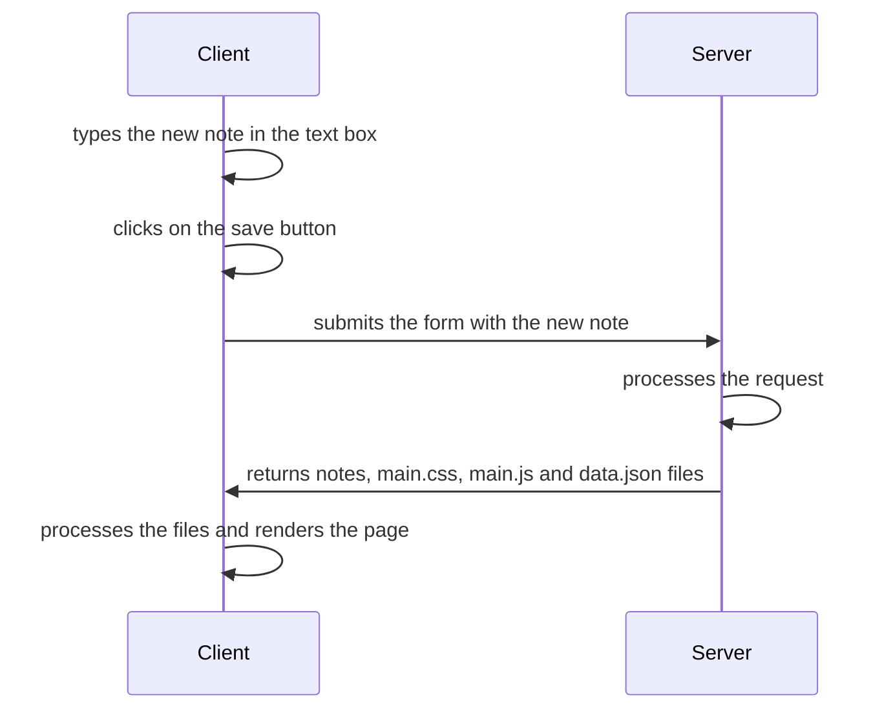

```mermaid
sequenceDiagram
    participant Client
    participant Server
    Client->>Client: types the new note in the text box
    Client->>Client: clicks on the save button
    Client->>Server: submits the form with the new note
    Server->>Server: processes the request
    Server->>Client: returns notes, main.css, main.js and data.json files
    Client->>Client: processes the files and renders the page
```