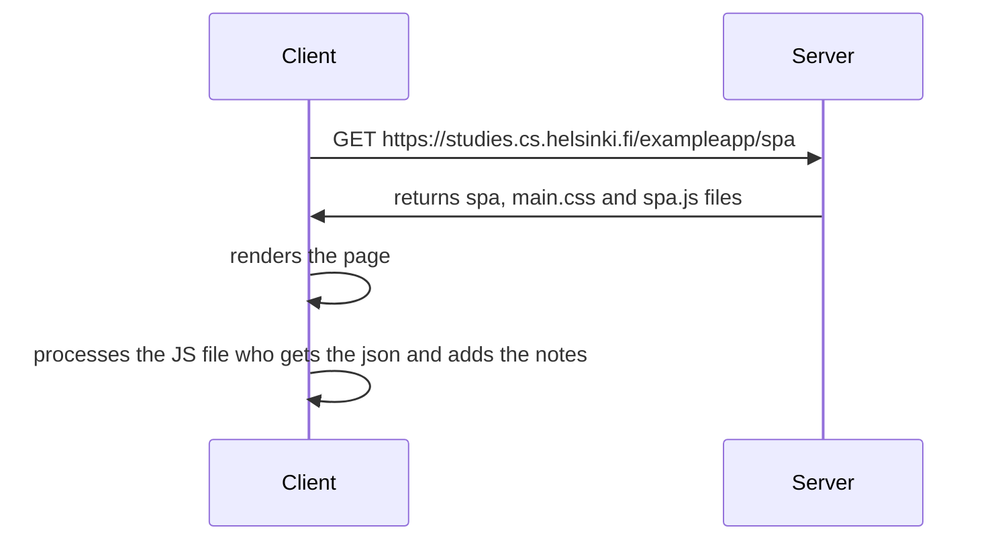

```mermaid
sequenceDiagram
    participant Client
    participant Server
    Client->>Server: GET https://studies.cs.helsinki.fi/exampleapp/spa
    Server->>Client: returns spa, main.css and spa.js files
    Client->>Client: renders the page
    Client->>Client: processes the JS file who gets the json and adds the notes
```